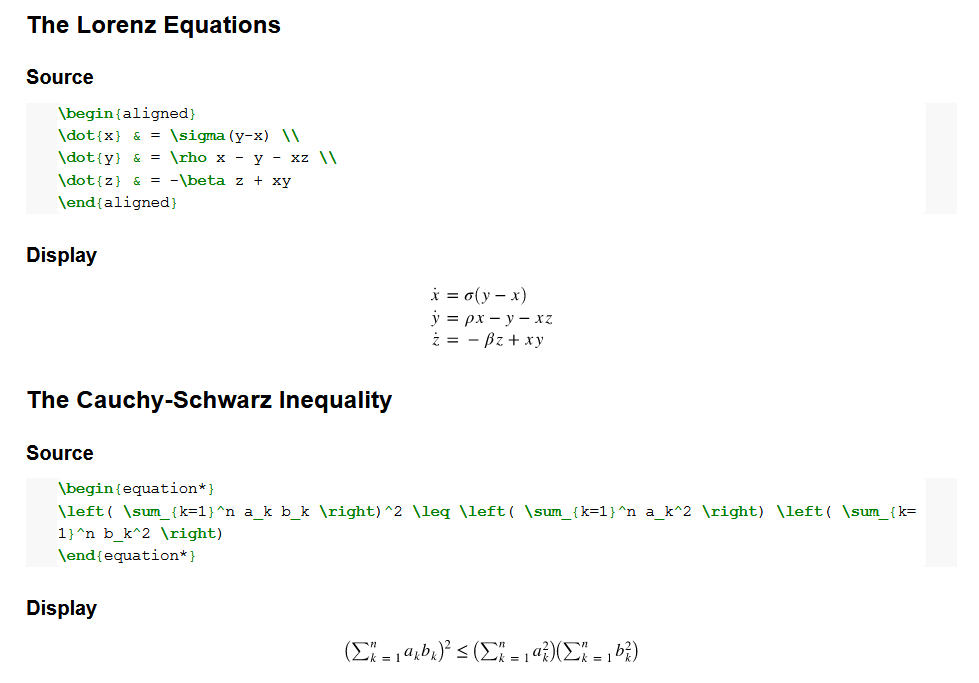
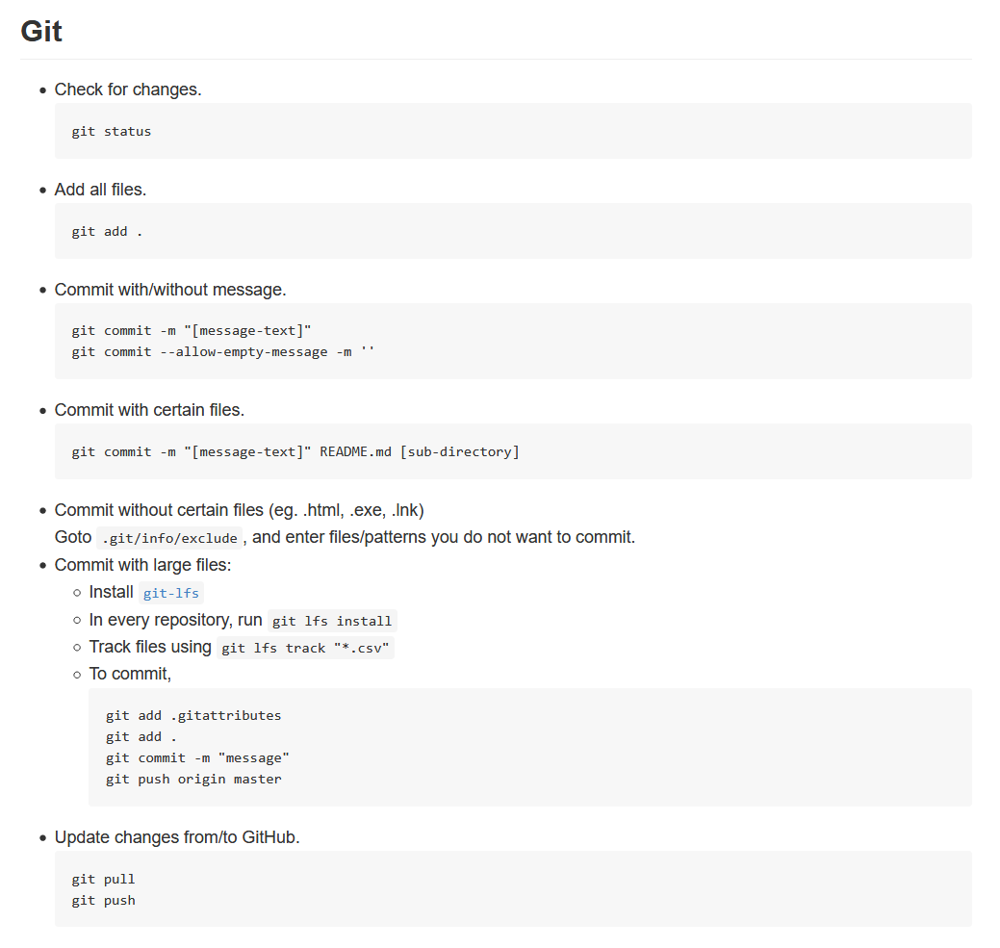
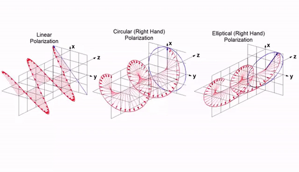

__Note: This is a template README used in the talk.__<br>
__Checkout the [slides](https://crtejaswi.github.io/Talks/02/github.html) for context.__

# Unboxing GitHub
> Lecture notes for __Unboxing GitHub__.

# Index

- [Formatted Text](#formatted-text)
- [Code](#code)
- [Maths](#maths)
- [Tables](#tables)
- [Images & AV Content](#av-content)

# Formatted Text

## Git & GitHub

- __What's Git?__ <br>
    Git is a distributed, version-control-system (VCS) for tracking changes in source code. <br>
    It was created by Linus Torvalds (= creator of _Linux_) to manage the [Linux Kernel source code](https://github.com/torvalds/linux). <br>

- __What's Github?__ <br>
    GitHub allows you to host your content (probably source code) on the internet, allowing you to manage it using Git. <br>

_So, Git is the tool that allows you to manage several versions of a software, and GitHub gives you a website where you can post your work online, and manage it using Git._ <br>

- __What's in it for you?__ <br>

    > Let's say, you want to write lecture notes for your class. Each lecture consists of a vast number of equations, tables, graphs, diagrams, simulations, code and obviously, formatted text. You want to update these notes as you go along the course. You also want to allow the reader to access only a certain portion of the notes (eg. Lec1,2,...) if he wants to.
    >
    > This is exactly what we will tackle in today's talk.

# Code

[List of Supported Languages](https://meta.stackexchange.com/a/335336)

- Python

```python
#!/usr/bin/env python3
import re


text = '''
abc1234!
'''
pattern = re.compile(r'(\bDoe\b)')
matches = pattern.finditer(text)
for match in matches:
    print(match)
```

- JavaScript

```javascript
const math = {
    sqrt(x){
        return Math.sqrt(x);
    },
    square(x) {
        return x ** 2;
    },
    cube(x){
        return x ** 3;
    },
    rms(x,y){
        return Math.sqrt(0.5* (x**2 + y**2));
    }
}
```

- Generic

```
>> If no language is mentioned, no syntax highlighting takes place.
Everything is printed out as it is.
```

# Maths

__LaTex Equations__ <br>
```
$e^{i \pi} = -1$
$x = a + b, y = a - b$

$$a^2x + bx + c = 0$$

$$\begin{vmatrix}a & b\\
c & d
\end{vmatrix}=ad-bc$$

```

### __Option1: [Jupyter Notebooks](https://gist.github.com/cyhsutw/d5983d166fb70ff651f027b2aa56ee4e)__ <br>
 <br>

### __Option2: [The GitHub Way](https://gist.github.com/a-rodin/fef3f543412d6e1ec5b6cf55bf197d7b)__ <br>
 <br>
 <br>
 <br>

# Tables

| Step | Explanation | Example |
| :-- | :--: | --: |
| __clone__ | Create a local copy of the repository | `git clone https://github.com/CRTejaswi/Test.git` |
| pull | Update changes from GitHub | `git pull` |
| status | Check for changes in file(s) | `git status` |
| add | Add files to be updated | `git add .` |
| commit | Record file changes in local database | `git commit -m 'Updated README'` |
| push | Update changes to GitHub | `git push origin master` |


# AV Content
> Graphs/Diagrams/Simulations/Videos ...

<center>
    
    
    <audio src="resources/test.mp3" controls preload></audio>
    <video src="resources/test.mp4" width="720" height="480" controls preload></video>
</center>